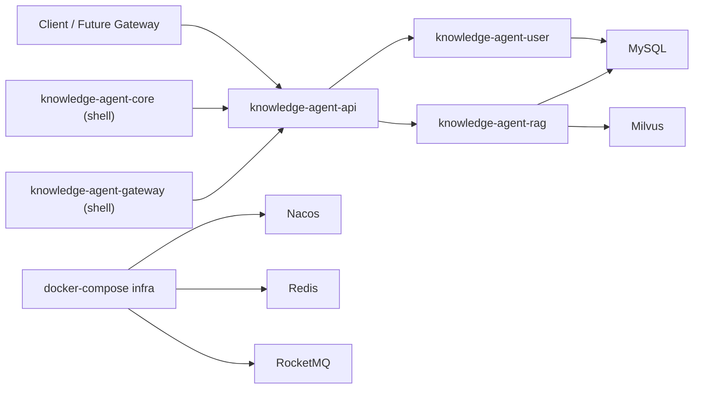
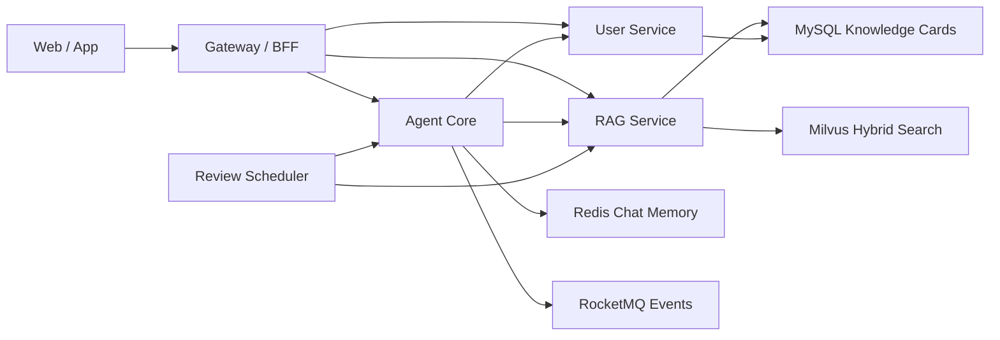

# Knowledge Agent Platform

面向知识辅导、知识沉淀与复习调度的学习型 Knowledge Agent 平台。项目基于 Spring Boot + Dubbo + LangChain4j + Milvus 构建，当前处于“工程骨架已成型、User/RAG 能力已落地、Agent Core 与 Gateway 待闭环”的阶段。

## 项目定位

| 维度 | 当前定位 |
| :--- | :--- |
| 产品主线 | 学习型知识 Agent，而非通用企业 AI 门户 |
| 核心目标 | 帮助用户完成知识辅导、知识归档、复习提醒 |
| 当前形态 | Dubbo 微服务原型，优先打通服务边界与核心链路 |
| 文档原则 | 以代码事实为准，目标态能力单独标记为“规划中” |

## 当前状态

- 代码已存在：多模块 Maven/Dubbo 工程骨架，包含 `knowledge-agent-common`、`knowledge-agent-api`、`knowledge-agent-user`、`knowledge-agent-rag`、`knowledge-agent-core`、`knowledge-agent-gateway`
- 代码已存在：`UserService.login`、`UserService.getUserProfile`
- 代码已存在：`RagService.saveKnowledge`、`RagService.updateReviewStatus`
- 代码已存在：Milvus Hybrid Retrieval 底座，包含 dense + sparse + RRF 检索能力
- 代码已存在：MySQL/Flyway 初始化脚本，覆盖用户表与知识复习卡片表
- 代码已存在：`docker-compose.yml` 中的 Nacos、Redis、MySQL、RocketMQ 依赖编排骨架
- 代码已存在：Gateway 鉴权拦截器、Review 批次派发/去重、登录触发与定时调度入口
- 代码已存在：JWT 令牌工具与 Gateway 对外 API 文档草案
- 当前仍待补齐：真实 User HTTP 接口、标准化 RAG 导入链路、真实 LangChain4j 运行时接入
- 规划中：FSM/ReAct 执行链增强、知识图谱、多模态生成

## 当前已实现能力

### 1. 工程与服务骨架

- 父工程采用 Maven 多模块结构，模块职责已经拆分清楚
- `knowledge-agent-api` 提供 Dubbo 公共接口与 DTO/Request 契约
- `knowledge-agent-common` 提供通用返回体、异常处理与 SM-2 复习算法工具
- `knowledge-agent-core` 已具备基础 Agent 编排链路，`knowledge-agent-gateway` 已具备鉴权、SSE/HTTP 入口与 Review 批次能力

### 2. User Service

- 已有 `sys_user` 表、实体、Mapper 与 Flyway 脚本
- 已实现登录校验，使用 BCrypt 校验密码
- 已实现学习风格画像读取，当前返回用户 `learningStyle`
- 当前返回的仍是 mock token，JWT 与登录态模型尚未落地

### 3. RAG Service

- 已有 `knowledge_card` 复习卡片表、实体、Mapper 与 Flyway 脚本
- 已实现知识归档写入：
  - 文本切分
  - Embedding 生成
  - Milvus 入库
  - MySQL 复习卡片初始化
- 已实现 SM-2 复习参数更新：`easiness_factor`、`interval_days`、`repetition`、`next_review_date`
- 已具备 Milvus collection 初始化能力，包含 dense/sparse 字段和 RRF 检索底座
- 当前已对外暴露基础搜索与待复习查询入口，但 citation/source/direct-answer 等响应结构仍待补齐

### 4. 基础依赖编排

- `docker-compose.yml` 已提供以下依赖骨架：
  - Nacos
  - Redis
  - MySQL
  - RocketMQ Namesrv/Broker/Proxy/Dashboard
- 当前依赖编排可作为本地开发环境基线，Redis 已接入 review 去重与批次缓存降级链路，RocketMQ 已补齐最小事件契约与收发骨架

## 规划中能力

以下内容属于设计目标，不应视为当前已完成：

- Agent Core 的 FSM 状态机与 ReAct 执行链
- 基于 LangChain4j Tools 的工具路由与 Prompt 装配
- Gateway/BFF 的入口层继续增强，但基础 HTTP API、统一鉴权与 SSE 已有可运行实现
- 文档导入与批处理知识入库流水线
- 登录触发或定时触发的复习提醒增强
- Redis 会话记忆、Review Queue 与提醒去重
- RocketMQ 驱动的异步知识归档/Review 批次事件流（当前为最小可用骨架）
- Neo4j 知识图谱、多模态生成、动态角色进化

## 公共契约分层

### 代码已存在

- `UserService.login`
- `UserService.getUserProfile`
- `RagService.saveKnowledge`
- `RagService.updateReviewStatus`
- `KnowledgeDTO`
- `ChatRequest`
- `UserLoginRequest`

### 契约已定义但无实现

- `AgentService.chat`
- `AgentService.switchState`

### 仅规划中

- `ConversationState`
- `StateContext`
- `ReviewTask`
- `ReminderEvent`
- 检索响应中的 citation/source/direct-answer 结构

## 架构设计

### 当前架构

当前实际可依赖的核心链路已经扩展到 `User + RAG + Agent Core MVP + Gateway 鉴权/Review 批次 + 基础依赖骨架`，但真实模型执行、标准化导入链路与持久化会话记忆仍待补齐。

### 目标架构

目标态中，`Gateway` 负责对外接入，`Agent Core` 负责意图判断、状态流转和工具调用，`RAG` 负责知识写入与召回，`Review Scheduler` 负责生成待复习任务。

## 端到端流程

### 1. 学习对话流

`输入接入` -> `身份与用户画像` -> `意图判断` -> `状态选择(IDLE/TEACHING/REVIEW/SUMMARY)` -> `知识检索` -> `LLM/Tool 执行` -> `结果返回` -> `可选知识归档`

推荐实现形态：

1. Gateway 接收用户输入并附带身份信息
2. Agent Core 读取用户画像和当前会话状态
3. Agent Core 根据意图选择教学、复习或总结状态
4. 需要知识补充时调用 RAG 检索
5. LLM 基于状态指令与工具结果生成响应
6. 在满足总结条件时触发知识归档

### 2. 知识归档流

`总结文本` -> `文本清洗` -> `切片` -> `Embedding` -> `Milvus 入库` -> `KnowledgeCard 初始化` -> `标签/来源元数据`

当前代码已覆盖：

- 总结文本接收
- 文本切分
- Embedding
- Milvus 入库
- `knowledge_card` 初始化

后续需要补全：

- 来源字段
- 标签过滤
- 引用回传
- 批处理导入

### 3. 复习提醒流

`登录或定时触发` -> `筛选 next_review_date 到期卡片` -> `生成复习列表` -> `Agent 提问` -> `质量评分(0..5)` -> `SM-2 更新` -> `提醒去重`

当前代码已覆盖：

- SM-2 参数计算
- 复习结果更新

当前尚未覆盖：

- 待复习卡片查询
- Review Queue
- 登录触发
- 定时调度
- Agent 复习交互
- 去重策略

## 为什么这样设计

本项目在目标形态上借鉴了 Dify、FastGPT、MaxKB、RAGFlow、LangChain4j 和 Milvus 的成熟做法，但落地方式保持当前 Dubbo 微服务边界，不直接演进成低代码工作流产品。

### 设计原则 1：节点化编排，但先落服务化 MVP

- 借鉴 Dify/MaxKB/FastGPT 的分类、分支、检索、变量记忆思想
- 当前阶段先把这些节点能力沉淀为后端服务与明确接口，再考虑可视化编排

### 设计原则 2：多路检索与重排优先于过早上图谱

- 当前 RAG 已具备 dense + sparse + RRF 的良好基础
- 在标准检索接口、引用回传、召回质量稳定之前，不优先推进知识图谱

### 设计原则 3：会话记忆与知识记忆分层

- 短期会话记忆适合 Redis 或 Chat Memory
- 长期知识沉淀适合 MySQL + Milvus
- 复习参数属于长期知识记忆的一部分，不应混入短期上下文缓存

### 设计原则 4：导入链路、检索链路、对话链路分离

- 导入链路负责清洗、切片、向量化和入库
- 检索链路负责召回、重排和结果封装
- 对话链路负责状态控制、提示词装配和工具调度

这种拆分有利于后续将同步 Dubbo 调用逐步演进为 RocketMQ 异步事件流。

## 参考项目与设计来源

- [Dify Knowledge Retrieval](https://docs.dify.ai/en/use-dify/nodes/knowledge-retrieval)
- [Dify Agent](https://docs.dify.ai/en/use-dify/nodes/agent)
- [Dify Variable Assigner](https://docs.dify.ai/en/use-dify/nodes/variable-assigner)
- [FastGPT Knowledge Base Search Merge](https://doc.fastgpt.io/en/docs/introduction/guide/dashboard/workflow/knowledge_base_search_merge)
- [MaxKB Knowledge Base](https://docs.maxkb.pro/user_manual/dataset/dataset/)
- [MaxKB Workflow](https://docs.maxkb.pro/user_manual/app/workflow_app/)
- [RAGFlow](https://github.com/infiniflow/ragflow)
- [LangChain4j AI Services](https://docs.langchain4j.dev/tutorials/ai-services/)
- [LangChain4j Chat Memory](https://docs.langchain4j.dev/tutorials/chat-memory/)
- [Milvus RRF Ranker](https://milvus.io/docs/id/rrf-ranker.md)

## 本地启动说明

### 1. 基础依赖

优先启动：

1. MySQL
2. Nacos
3. Milvus
4. Redis
5. RocketMQ

项目中已提供 `docker-compose.yml` 作为本地依赖基线，但其中未包含 Milvus，需要额外准备。

### 2. 推荐启动顺序

1. `knowledge-agent-user`
2. `knowledge-agent-rag`
3. `knowledge-agent-core`
4. `knowledge-agent-gateway`

当前 `user`、`rag`、`core`、`gateway` 均已有明确业务职责，其中 `core/gateway` 仍处于 MVP 到稳定版之间的加固阶段。

### 3. 构建与测试现状

- 2026-03-17：`mvn -DskipTests compile` 已通过
- 2026-03-17：`mvn test` 未通过，主要原因是测试启动依赖本地 `Nacos` 和其他外部组件
- 因此当前应区分：
  - 可编译
  - 依赖齐全时可集成运行
  - 业务链路完整闭环

## 模块说明

### `knowledge-agent-common`

公共返回体、异常处理、工具类。

### `knowledge-agent-api`

Dubbo 服务接口、DTO、Request 契约。

### `knowledge-agent-user`

用户登录、学习风格画像与用户基础数据。

### `knowledge-agent-rag`

知识归档、Milvus 检索底座、复习参数更新。

### `knowledge-agent-core`

当前为 Agent Core 壳模块，后续承接 FSM/ReAct、Prompt 装配、Tool 路由和会话记忆。

### `knowledge-agent-gateway`

当前已提供 HTTP API、SSE、Bearer Token 鉴权与 review 相关入口，后续继续补齐统一外部契约与更稳定的入口层能力。

## 后续文档整理建议

- 根目录 `README.md` 负责描述整个平台
- `knowledge-agent-core/README.md` 后续应收敛为 Core 模块内部设计说明，避免与根文档重复或冲突
- `ROADMAP.md` 负责描述阶段目标与完成判定，不承担产品宣传角色
